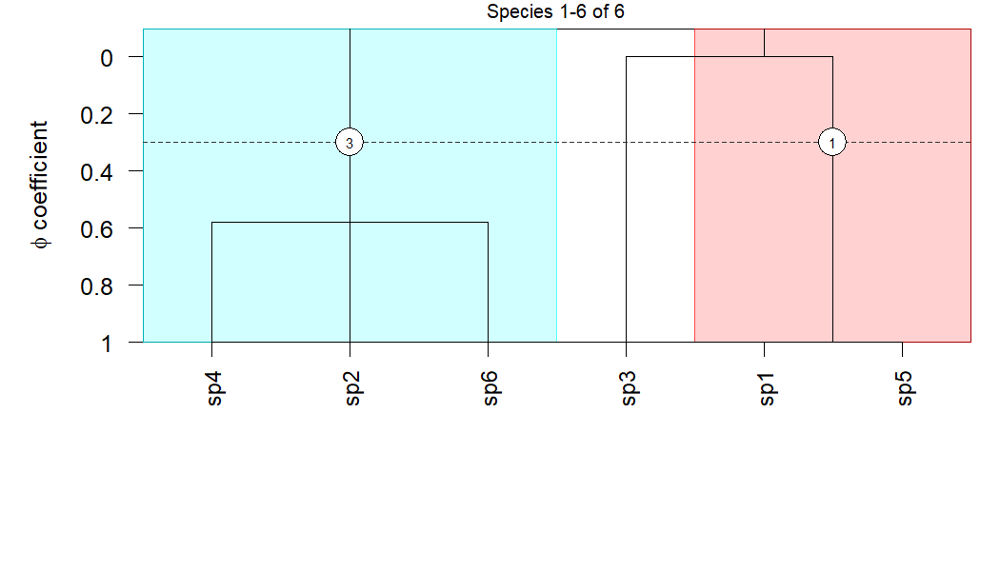
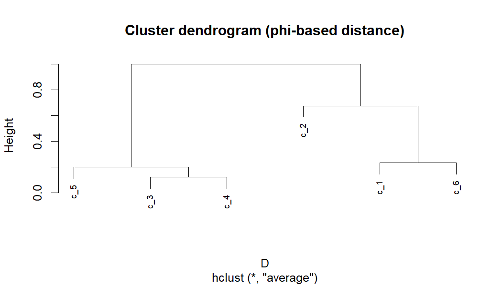
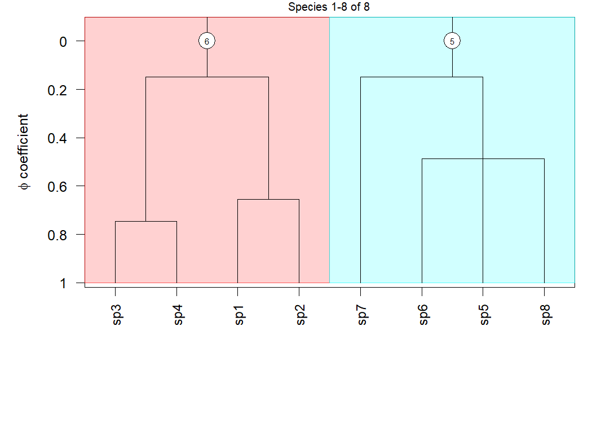

cocktailr
================

- [cocktailr](#cocktailr)
  - [Overview](#overview)
  - [Background](#background)
  - [Installation](#installation)
  - [Typical workflow](#typical-workflow)
    - [1. Visualise the dendrogram](#1-visualise-the-dendrogram)
    - [2. Select parent clusters at a φ
      cut](#2-select-parent-clusters-at-a-φ-cut)
    - [3. Diagnostic species for parent
      clusters](#3-diagnostic-species-for-parent-clusters)
    - [4. φ-based distances between
      clusters](#4-φ-based-distances-between-clusters)
    - [5. Visualise grouped nodes on the Cocktail
      dendrogram](#5-visualise-grouped-nodes-on-the-cocktail-dendrogram)
    - [6. Assign plots (relevés) to
      groups](#6-assign-plots-relevés-to-groups)
    - [(Optional) Attach assignments to a header data
      frame](#optional-attach-assignments-to-a-header-data-frame)
  - [Reference](#reference)

# cocktailr

Fast, reproducible *Cocktail* clustering for vegetation tables.

------------------------------------------------------------------------

## Overview

**cocktailr** provides fast and reproducible *Cocktail* clustering of
vegetation data, identifying groups of co-occurring species from **plots
× species** tables. It uses optimized sparse-matrix calculations and φ
(phi) coefficients to produce consistent, deterministic results, even
for large vegetation databases.

The package implements:

- **Hierarchical Cocktail clustering** of species
  (`cocktail_cluster()`).
- **Dendrogram plotting** with φ heights and optional cluster bands
  (`cocktail_plot()`).
- Extraction of **parent clusters at a φ cut** (`clusters_at_cut()`).
- **Diagnostic species lists** for clusters or unions of clusters
  (`species_in_clusters()`).
- **φ-based distances between clusters** (`cluster_phi_dist()`).
- **Assignment of plots (relevés) to groups** using several strategies
  that combine covers, topology, and species–cluster φ
  (`assign_releves()`).

------------------------------------------------------------------------

## Background

The *Cocktail* method (Bruelheide 2000, 2016) identifies sets of species
that co-occur more often than expected by chance and merges them
hierarchically according to the **phi coefficient of association**. Each
resulting cluster is characterized by its diagnostic species and a
threshold (*m*) indicating how many group species a plot must contain to
belong to it.

For details, see the original works:

- Bruelheide, H. (2000). *A new measure of fidelity and its application
  to defining species groups.* **Journal of Vegetation Science**, 11,
  167–178. <https://doi.org/10.2307/3236796>  
- Bruelheide, H. (2016). *Cocktail clustering – a new hierarchical
  agglomerative algorithm for extracting species groups in vegetation
  databases.* **Journal of Vegetation Science**, 27(6), 1297–1307.
  <https://doi.org/10.1111/jvs.12454>

------------------------------------------------------------------------

## Installation

``` r
# Install from GitHub
remotes::install_github("dvynokur/cocktailr")
```

------------------------------------------------------------------------

## Typical workflow

A small end-to-end example on a toy **plots × species** matrix, showing:

1.  Cocktail clustering with optional species–cluster φ.
2.  Dendrogram plotting.
3.  Selecting clusters at a φ cut.
4.  Diagnostic species lists.
5.  φ-based distances between clusters and grouping.
6.  Plot assignment using φ and cover, optionally with grouped nodes.

``` r
library(cocktailr)

# Toy plots × species matrix with percentage cover
vm <- matrix(
  c(
    60,50,40,30,  5, 0,10, 0,
    55,45,35,25, 10, 5, 0, 0,
    50,40,30,20,  5,10, 0, 5,
    45,35,25,15,  0, 5, 5, 0,
    10, 5, 0, 0, 60,50,40,30,
     5,10, 0, 0, 55,45,35,25,
     0, 5,10, 0, 50,40,30,20,
     0, 0, 5,10, 45,35,25,15
  ),
  nrow = 8, byrow = TRUE,
  dimnames = list(
    paste0("plot", 1:8),
    paste0("sp",   1:8)
  )
)

# 1) Cocktail clustering, keeping relative cover and species–cluster phi
res <- cocktail_cluster(
  vegmatrix           = vm,
  progress            = FALSE,
  plot_values         = "rel_cover",   # keeps cover-based Plot.cluster
  species_cluster_phi = TRUE           # computes Species.cluster.phi
)

names(res)
#> [1] "Cluster.species"     "Cluster.info"        "Plot.cluster"        "Cluster.merged"      "Cluster.height"     
#> [6] "Species.cluster.phi" "species"             "plots"
```

### 1. Visualise the dendrogram

``` r
# Plot to the current device with a phi cut and labels at that cut
cocktail_plot(
  x              = res,
  file           = NULL,       # RStudio Plots pane / current device
  phi_cut        = 0.25,
  label_clusters = TRUE,
  cex_species    = 0.9
)
```



### 2. Select parent clusters at a φ cut

``` r
phi_cut <- 0.25

parent_labels <- clusters_at_cut(
  x         = res,
  phi       = phi_cut,
  as_labels = TRUE
)

parent_labels
#> [1] "c_1" "c_2" "c_4"
```

### 3. Diagnostic species for parent clusters

Topological species per parent cluster:

``` r
diag_sp_topo <- species_in_clusters(
  x      = res,
  labels = parent_labels
)

diag_sp_topo
#> $c_1
#> [1] "sp3" "sp4"
#> 
#> $c_2
#> [1] "sp1" "sp2"
#> 
#> $c_4
#> [1] "sp5" "sp6" "sp8"
```

With φ-based filtering and ranking (uses `Species.cluster.phi`):

``` r
diag_sp_phi <- species_in_clusters(
  x                   = res,
  labels              = parent_labels,
  species_cluster_phi = TRUE,
  min_phi             = 0.20
)

diag_sp_phi
#> $c_1
#>   species      phi
#> 1     sp4 1.000000
#> 2     sp3 0.745356
#> 
#> $c_2
#>   species       phi
#> 1     sp1 1.0000000
#> 2     sp2 0.6546537
#> 
#> $c_4
#>   species     phi
#> 1     sp8 1.00000
#> 2     sp5 0.48795
#> 3     sp6 0.48795
```

### 4. φ-based distances between clusters

Compute a distance matrix between clusters based on species fidelity
profiles.  
Here we include all nodes with `Cluster.height >= 0.1` to get a richer
hierarchy for *hclust*:

``` r
D <- cluster_phi_dist(
  x       = res,
  min_phi = 0.1          # keep nodes with merge phi >= 0.1
)

D
#>           c_1       c_2       c_3       c_4       c_5
#> c_2 0.9939541                                        
#> c_3 1.1091837 1.0559572                              
#> c_4 1.1091837 1.0559572 0.8336476                    
#> c_5 1.1359380 1.0676871 0.8703734 0.8703734          
#> c_6 0.8640620 0.9323129 1.1296266 1.1296266 1.1393197

# Hierarchical clustering of clusters
hc_nodes <- hclust(D, method = "average")

plot(hc_nodes, main = "Cluster dendrogram (phi-based distance)", cex = 0.7)
```



``` r

grp_nodes <- cutree(hc_nodes, k = 2)
grp_nodes
#> c_1 c_2 c_3 c_4 c_5 c_6 
#>   1   1   2   2   2   1
table(grp_nodes)
#> grp_nodes
#> 1 2 
#> 3 3

# Build node groups as character labels ("c_1", "c_2", …) per group
node_groups <- split(names(grp_nodes), grp_nodes)
node_groups
#> $`1`
#> [1] "c_1" "c_2" "c_6"
#> 
#> $`2`
#> [1] "c_3" "c_4" "c_5"
```

### 5. Visualise grouped nodes on the Cocktail dendrogram

We can use `clusters = node_groups` to show union groups as coloured
bands and label cluster IDs. Within each group, if both an ancestor and
a descendant node are present, only the **topmost** (ancestor) is used
for labelling and band placement.

``` r
cocktail_plot(
  x              = res,
  clusters       = node_groups,
  label_clusters = TRUE,
  cex_species    = 0.9
)
```



### 6. Assign plots (relevés) to groups

Use `assign_releves()` with one of the strategies:

- `"count"` – number of diagnostic species present.
- `"cover"` – summed relative cover of diagnostic species.
- `"phi_topo"` – sum of phi over topological species present.
- `"phi_cover_topo"` – sum of relative cover × phi over topological
  species.
- `"phi_cover"` – sum of relative cover × phi for species with phi ≥
  `min_phi`.
- `"phi"` – sum of phi for species with phi ≥ `min_phi`.

Here we use `"phi_cover"` with the parent clusters at `phi_cut`:

``` r
assign_phi <- assign_releves(
  x              = res,
  vegmatrix      = vm,
  strategy       = "phi_cover",
  phi_cut        = phi_cut,
  min_phi        = 0.20,
  min_group_size = 1L
)

assign_phi
#> plot1 plot2 plot3 plot4 plot5 plot6 plot7 plot8 
#> "g_2" "g_2" "g_2" "g_2" "g_4" "g_4" "g_4" "g_4" 
#> attr(,"details")
#> attr(,"details")$strategy
#> [1] "phi_cover"
#> 
#> attr(,"details")$phi_cut
#> [1] 0.25
#> 
#> attr(,"details")$clusters
#> NULL
#> 
#> attr(,"details")$groups_used
#> [1] "g_1" "g_2" "g_4"
#> 
#> attr(,"details")$min_phi
#> [1] 0.2
#> 
#> attr(,"details")$min_group_size
#> [1] 1
#> 
#> attr(,"details")$collapsed_groups
#> character(0)
table(assign_phi)
#> assign_phi
#> g_2 g_4 
#>   4   4
```

The returned object is a named character vector (names = plot IDs). Each
value is:

- a group label such as `"g_5"` for groups defined by a single node, or
  `"g_5_12"` for union groups of multiple non-nested nodes;
- `"+"` when there is an unresolved tie between groups;
- `"-"` for groups that were collapsed because they contain fewer plots
  than `min_group_size`;
- `NA` when no group wins for that plot.

For union groups that include both ancestors and descendants, only the
**topmost** ancestor is kept within that group. In those cases, the
label is just the ancestor ID (e.g. `"g_5"`), not a combined ID.

You can then attach these assignments to your plot header / metadata
table.

------------------------------------------------------------------------

### (Optional) Attach assignments to a header data frame

If you have a header table `hea` with a column `releve_number`, you can
add multiple assignment strategies as new columns:

``` r
library(dplyr)

# Example strategies you want as separate columns
strategies <- c("count", "cover", "phi_topo", "phi_cover_topo", "phi_cover")

hea2 <- hea

for (s in strategies) {
  rel_assigned <- assign_releves(
    x              = res,
    vegmatrix      = vm,
    strategy       = s,
    phi_cut        = 0.25,
    min_phi        = 0.20,
    min_group_size = 2
  )

  # Align by releve_number using the names of rel_assigned
  idx <- match(hea2$releve_number, as.integer(names(rel_assigned)))

  colname <- paste0("grp_", s)  # e.g. "grp_count", "grp_cover", ...

  hea2[[colname]] <- rel_assigned[idx]

  # Optional: turn "-" into NA instead of a literal dash
  # hea2[[colname]][hea2[[colname]] == "-"] <- NA_character_
}

dplyr::glimpse(hea2)
```

------------------------------------------------------------------------

## Reference

See function help for details:

- `?cocktail_cluster` – build the Cocktail tree, optionally with
  species–cluster phi  
- `?cocktail_plot` – draw dendrograms (PDF/PNG or current device)  
- `?clusters_at_cut` – parent clusters at a phi cut  
- `?species_in_clusters` – diagnostic species per node or node union  
- `?cluster_phi_dist` – phi-based distances between clusters  
- `?assign_releves` – assign plots to groups using covers and phi

------------------------------------------------------------------------

© 2025 Denys Vynokurov & Helge Bruelheide. Licensed under MIT.
