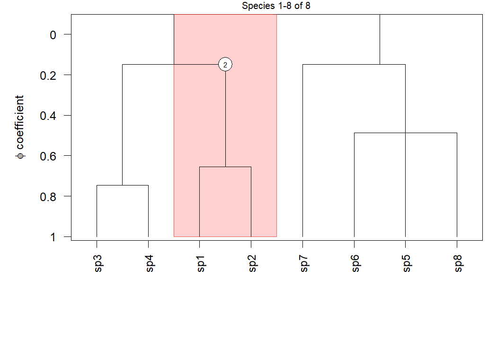
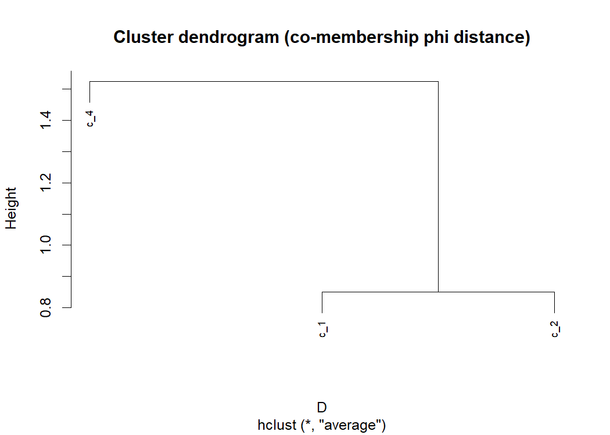

cocktailr
================

- [cocktailr](#cocktailr)
  - [Overview](#overview)
  - [Background](#background)
  - [Installation](#installation)
  - [Typical workflow](#typical-workflow)
    - [1) Visualise the dendrogram](#1-visualise-the-dendrogram)
    - [2) Select clusters at a φ cut **or** select strongest clusters by
      score](#2-select-clusters-at-a-φ-cut-or-select-strongest-clusters-by-score)
    - [3) Cluster diagnostics (helper
      functions)](#3-cluster-diagnostics-helper-functions)
    - [4) Diagnostic species for selected
      clusters](#4-diagnostic-species-for-selected-clusters)
    - [5) Distances between clusters (direct plot co-membership
      φ)](#5-distances-between-clusters-direct-plot-co-membership-φ)
    - [6) Visualise grouped nodes on the Cocktail
      dendrogram](#6-visualise-grouped-nodes-on-the-cocktail-dendrogram)
    - [7) Assign plots (relevés) to
      groups](#7-assign-plots-relevés-to-groups)
    - [(Optional) Attach assignments to a header data
      frame](#optional-attach-assignments-to-a-header-data-frame)
  - [Reference](#reference)

# cocktailr

Fast, reproducible *Cocktail* clustering for vegetation tables.

------------------------------------------------------------------------

## Overview

**cocktailr** provides fast and reproducible *Cocktail* clustering of
vegetation data, identifying groups of co-occurring species from **plots
× species** tables. It uses optimized sparse-matrix calculations and φ
(phi) coefficients to produce consistent, deterministic results, even
for large vegetation databases.

The package implements:

- **Hierarchical Cocktail clustering** of species
  (`cocktail_cluster()`).
- **Dendrogram plotting** with φ heights and optional cluster bands
  (`cocktail_plot()`).
- Extraction of **parent clusters at a φ cut** (`clusters_at_cut()`).
- **Selection of strong clusters** by a combined score
  (`select_clusters()`).
- **Diagnostic species lists** for clusters or unions of clusters
  (`species_in_clusters()`).
- Listing **plots (relevés) belonging to clusters or cluster unions**
  (`releves_in_clusters()`).
- Finding **clusters that contain a given species (or set of species)**
  (`clusters_with_species()`).
- **Distances between clusters** based on direct plot co-membership φ
  (`cluster_phi_dist()`).
- **Assignment of plots (relevés) to groups** using cover- and φ-based
  strategies (`assign_releves()`).

------------------------------------------------------------------------

## Background

The *Cocktail* method (Bruelheide 2000, 2016) identifies sets of species
that co-occur more often than expected by chance and merges them
hierarchically according to the **phi coefficient of association**. Each
resulting cluster is characterized by its diagnostic species and a
threshold (*m*) indicating how many group species a plot must contain to
belong to it.

For details, see the original works:

- Bruelheide, H. (2000). *A new measure of fidelity and its application
  to defining species groups.* **Journal of Vegetation Science**, 11,
  167–178. <https://doi.org/10.2307/3236796>  
- Bruelheide, H. (2016). *Cocktail clustering – a new hierarchical
  agglomerative algorithm for extracting species groups in vegetation
  databases.* **Journal of Vegetation Science**, 27(6), 1297–1307.
  <https://doi.org/10.1111/jvs.12454>

------------------------------------------------------------------------

## Installation

``` r
# Install from GitHub
remotes::install_github("dvynokur/cocktailr")
```

------------------------------------------------------------------------

## Typical workflow

A small end-to-end example on a toy **plots × species** matrix, showing:

1.  Cocktail clustering  
2.  Dendrogram plotting  
3.  Select clusters at a φ cut **or** select strongest clusters by
    score  
4.  Cluster diagnostics (new helper functions)  
5.  Species lists  
6.  Distances between clusters  
7.  Plot assignment

``` r
library(cocktailr)

# Toy plots × species matrix with percentage cover
vm <- matrix(
  c(
    60,50,40,30,  5, 0,10, 0,
    55,45,35,25, 10, 5, 0, 0,
    50,40,30,20,  5,10, 0, 5,
    45,35,25,15,  0, 5, 5, 0,
    10, 5, 0, 0, 60,50,40,30,
     5,10, 0, 0, 55,45,35,25,
     0, 5,10, 0, 50,40,30,20,
     0, 0, 5,10, 45,35,25,15
  ),
  nrow = 8, byrow = TRUE,
  dimnames = list(
    paste0("plot", 1:8),
    paste0("sp",   1:8)
  )
)

# 1) Cocktail clustering, keeping relative cover and species–cluster phi
res <- cocktail_cluster(
  vegmatrix           = vm,
  progress            = FALSE,
  plot_values         = "rel_cover",
  species_cluster_phi = TRUE
)

names(res)
#> [1] "Cluster.species"     "Cluster.info"        "Plot.cluster"       
#> [4] "Cluster.merged"      "Cluster.height"      "Species.cluster.phi"
#> [7] "species"             "plots"
```

------------------------------------------------------------------------

### 1) Visualise the dendrogram

``` r
cocktail_plot(
  x              = res,
  file           = NULL,       # plot to device
  phi_cut        = 0.25,
  label_clusters = TRUE,
  cex_species    = 0.9
)
```


------------------------------------------------------------------------

### 2) Select clusters at a φ cut **or** select strongest clusters by score

#### Option A: Parent clusters at a φ cut

``` r
phi_cut <- 0.25

parent_labels <- clusters_at_cut(
  x         = res,
  phi_cut   = phi_cut,
  as_labels = TRUE
)

parent_labels
#> [1] "c_1" "c_2" "c_4"
```

#### Option B: Strong clusters by score (merge φ × log(k) × log(m))

``` r
strong_labels <- select_clusters(
  x         = res,
  min_phi   = 0.20,
  min_k     = 1,
  min_score = 0.3,
  mode      = "strict",
  return    = "labels"
)

strong_labels
#> [1] "c_4" "c_1" "c_2"
```

(If you want the full score table:)

``` r
strong_table <- select_clusters(
  x         = res,
  min_phi   = 0.20,
  min_k     = 1,
  min_score = 0.3,
  mode      = "strict",
  return    = "table"
)

strong_table
#>   cluster         h k m     score
#> 3     c_4 0.4879500 3 3 0.5889308
#> 1     c_1 0.7453560 2 2 0.3581085
#> 2     c_2 0.6546537 2 2 0.3145303
```

------------------------------------------------------------------------

### 3) Cluster diagnostics (helper functions)

These two helpers allow quick inspection of clusters and cluster unions.

#### (a) List plots belonging to clusters or cluster unions

``` r
# example: plots belonging to the first two parent clusters
releves_A <- releves_in_clusters(res, clusters = parent_labels[1])
releves_B <- releves_in_clusters(res, clusters = parent_labels[3])

releves_A
#> $c_1
#> [1] "plot1" "plot2" "plot3" "plot4" "plot8"
releves_B
#> $c_4
#> [1] "plot3" "plot5" "plot6" "plot7" "plot8"
```

Union groups (list input): plots belonging to *any node in the union*:

``` r
union_example <- list(
  group1 = parent_labels[1:2]
)

releves_union <- releves_in_clusters(res, clusters = union_example)
releves_union
#> $g_1_2
#> [1] "plot1" "plot2" "plot3" "plot4" "plot5" "plot6" "plot8"
```

#### (b) Find clusters that contain a given species (or set of species)

``` r
# Clusters that contain sp1 (default: only clusters with merge phi >= 0 are returned)
clusters_with_species(res, species = "sp1")
#> [1] "c_2" "c_6"

# Clusters that contain BOTH sp1 and sp2,
# restricted to clusters with merge phi >= 0.2
cl <- clusters_with_species(
  res,
  species = c("sp1", "sp2"),
  match   = "all",
  min_phi = 0.2
)

cl
#> [1] "c_2"

# highlight clusters that contain both sp1 and sp2
cocktail_plot(
  x              = res,
  file           = NULL,
  clusters       = cl,
  label_clusters = TRUE,
  cex_species    = 0.9
)
```



------------------------------------------------------------------------

### 4) Diagnostic species for selected clusters

Membership species per cluster (node-constituting species):

``` r
diag_sp_member <- species_in_clusters(
  x      = res,
  labels = parent_labels
)

diag_sp_member
#> $c_1
#> [1] "sp3" "sp4"
#> 
#> $c_2
#> [1] "sp1" "sp2"
#> 
#> $c_4
#> [1] "sp5" "sp6" "sp8"
```

With φ-based filtering/ranking (uses Species.cluster.phi):

``` r
diag_sp_phi <- species_in_clusters(
  x                   = res,
  labels              = parent_labels,
  species_cluster_phi = TRUE,
  min_phi             = 0.20
)

diag_sp_phi
#> $c_1
#>   species      phi
#> 1     sp4 1.000000
#> 2     sp3 0.745356
#> 
#> $c_2
#>   species       phi
#> 1     sp1 1.0000000
#> 2     sp2 0.6546537
#> 
#> $c_4
#>   species     phi
#> 1     sp8 1.00000
#> 2     sp5 0.48795
#> 3     sp6 0.48795
```

------------------------------------------------------------------------

### 5) Distances between clusters (direct plot co-membership φ)

`cluster_phi_dist()` computes distances between clusters using the φ
coefficient between their **binary plot-membership vectors** (membership
= `Plot.cluster > 0`). Distance is always: `d(A,B) = 1 - phi(A,B)`.

We must provide which nodes to compare (e.g. strong clusters):

``` r
nodes_for_dist <- select_clusters(
  x         = res,
  min_score = 0,
  mode      = "strict",
  return    = "labels"
)


D <- cluster_phi_dist(
  x        = res,
  clusters = nodes_for_dist
)

D
#>           c_1       c_2
#> c_2 0.8509288          
#> c_4 1.6000000 1.4472136
```

Hierarchical clustering of clusters:

``` r
hc_nodes <- hclust(D, method = "average")

plot(hc_nodes, main = "Cluster dendrogram (co-membership phi distance)", cex = 0.7)
```



``` r

grp_nodes <- cutree(hc_nodes, k = 2)
table(grp_nodes)
#> grp_nodes
#> 1 2 
#> 2 1

# Node unions: group -> vector of node labels ("c_12", ...)
node_groups <- split(names(grp_nodes), grp_nodes)
node_groups
#> $`1`
#> [1] "c_1" "c_2"
#> 
#> $`2`
#> [1] "c_4"
```

------------------------------------------------------------------------

### 6) Visualise grouped nodes on the Cocktail dendrogram

You can pass union groups (`node_groups`) to `cocktail_plot()`:

``` r
cocktail_plot(
  x              = res,
  clusters       = node_groups,
  label_clusters = TRUE,
  cex_species    = 0.9
)
```


------------------------------------------------------------------------

### 7) Assign plots (relevés) to groups

`assign_releves()` assigns each plot to one of the provided cluster
groups.

Strategies:

- `"count"` – number of candidate species present
- `"cover"` – summed cover of candidate species
- `"phi"` – sum of φ weights over candidate species
- `"phi_cover"` – sum of cover × φ over candidate species

Candidate species logic:

- Candidate species are the cluster membership species
  (node-constituting species from `Cluster.species`).
- For `"phi"` and `"phi_cover"`:
  - `min_phi = NULL` (default): candidate species are node-constituting
    species.
  - `min_phi = 0.2` (example): candidate species are taken from **full
    fidelity profiles** (`Species.cluster.phi`), using those with φ ≥
    min_phi.

Membership restriction:

- `plot_membership = TRUE` (default): only groups where the plot is a
  Cocktail member compete.
- `plot_membership = FALSE`: all groups compete for all plots.

Example: assign to the parent clusters at `phi_cut = 0.25`. The
assignment `"+"` appears when a plot has an unresolved tie (two or more
groups share the same best score):

``` r
assign_phi <- assign_releves(
  x               = res,
  vegmatrix       = vm,
  strategy        = "count",
  clusters        = parent_labels,
  plot_membership = TRUE,
  min_group_size  = 1L
)

table(assign_phi)
#> assign_phi
#>   + g_4 
#>   3   5
```

Example: assign to union groups defined by cluster-distance grouping:

``` r
assign_unions <- assign_releves(
  x               = res,
  vegmatrix       = vm,
  strategy        = "phi_cover",
  clusters        = node_groups,
  plot_membership = TRUE,
  min_phi         = 0.20,
  min_group_size  = 1L
)

table(assign_unions)
#> assign_unions
#> g_1_2   g_4 
#>     4     4
```

The returned object is a named character vector (names = plot IDs). Each
value is:

- a group label such as `"g_5"` for groups defined by a single node, or
  `"g_5_12"` for union groups;
- `"+"` when there is an unresolved tie between groups;
- `"-"` for groups that were collapsed because they contain fewer plots
  than `min_group_size`;
- `NA` when no group wins for that plot (all scores 0 or no eligible
  group).

------------------------------------------------------------------------

### (Optional) Attach assignments to a header data frame

If you have a header table `hea` with a column `releve_number`, you can
add multiple assignment strategies as new columns:

``` r
library(dplyr)

strategies <- c("count", "cover", "phi", "phi_cover")

hea2 <- hea

# choose one grouping definition:
# parent_labels <- clusters_at_cut(res, phi_cut = 0.25, as_labels = TRUE)

for (s in strategies) {
  rel_assigned <- assign_releves(
    x               = res,
    vegmatrix       = vm,
    strategy        = s,
    clusters        = parent_labels,
    plot_membership = TRUE,
    min_phi         = 0.20,
    min_group_size  = 2
  )

  # Align by releve_number using the names of rel_assigned
  idx <- match(hea2$releve_number, as.integer(sub("^plot", "", names(rel_assigned))))

  colname <- paste0("grp_", s)
  hea2[[colname]] <- rel_assigned[idx]
}

dplyr::glimpse(hea2)
```

------------------------------------------------------------------------

## Reference

See function help for details:

- `?cocktail_cluster` – build the Cocktail tree, optionally with
  species–cluster phi  
- `?cocktail_plot` – draw dendrograms (PDF/PNG or current device)  
- `?clusters_at_cut` – parent clusters at a phi cut  
- `?select_clusters` – select strong clusters by score  
- `?species_in_clusters` – diagnostic species per node or node union  
- `?releves_in_clusters` – list plots belonging to clusters or union
  groups  
- `?clusters_with_species` – find clusters containing species  
- `?cluster_phi_dist` – distances between clusters (direct co-membership
  φ)  
- `?assign_releves` – assign plots to groups using covers and φ

------------------------------------------------------------------------

© 2025 Denys Vynokurov & Helge Bruelheide. Licensed under MIT.
